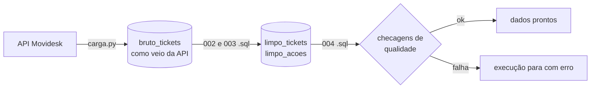

# Copiloto de Suporte

Projeto sobre os chamados reais de suporte de um ERP (TOTVS Protheus), atendidos pelo Movidesk.

> **Privacidade:** o projeto roda sobre dados reais de uma empresa, com autorização. **Nenhum dado de cliente está neste repositório.** Aqui estão só o código, o SQL e números agregados.

## O problema

No suporte, cada ticket novo passa por uma triagem manual: escolher categoria e urgência, entender o problema e procurar como casos parecidos foram resolvidos antes. Esse conhecimento fica espalhado nas conversas de tickets antigos e depende da memória de quem atende.

## Escopo

**Dados.** Coletar os tickets e as conversas, organizar num banco de dados e garantir que estejam atualizados e confiáveis.

**Análise e inferência: entender o porquê.** Descobrir o que explica o comportamento do suporte, separando efeito real de acaso:

- o que leva um ticket a estourar o SLA (categoria, urgência, cliente, dia e horário de abertura);
- quanto tempo cada tipo de ticket leva para ser resolvido, e com que incerteza;
- se as diferenças entre grupos são estatisticamente significativas, e de que tamanho são.

Uma ferramenta de apoio ao analista de suporte que, quando um ticket chega:

- mostra os tickets parecidos já resolvidos e como foram resolvidos;
- sugere categoria e urgência;
- indica o risco de o ticket estourar o SLA;
- propõe um rascunho de resposta, sempre revisado pelo analista antes de ser enviado.

Tudo isso depende de ter os tickets e as conversas organizados, atualizados e confiáveis num banco de dados. Essa é a parte construída até agora.

## O que foi feito até o momento

Um pipeline que coleta os tickets da API do Movidesk, guarda no PostgreSQL, organiza em tabelas prontas para análise e confere a qualidade dos dados a cada execução. Ele roda sozinho de hora em hora.



| Tabela | Conteúdo |
|---|---|
| `bruto_tickets` | Um ticket por linha, exatamente como a API devolveu (`jsonb`). Nunca é alterado pelo tratamento. |
| `limpo_tickets` | Um ticket por linha, com tipos corretos e datas com fuso. |
| `limpo_acoes` | Uma linha por mensagem do ticket, com autor (agente ou cliente) e visibilidade (pública ou interna). |

Hoje são cerca de 2,4 mil tickets e 11,4 mil mensagens, de março a setembro de 2026.

### Decisões

**O dado bruto é guardado antes de qualquer tratamento.** A API do Movidesk só devolve a versão atual de cada ticket. Guardar o retorno original em `jsonb` permite refazer o tratamento a partir do banco quando uma regra mudar, sem chamar a API de novo. O tratamento é feito em SQL, versionado na pasta `sql/`.

**A carga busca só o que mudou.** A primeira execução busca o histórico completo (cerca de 40 páginas). As seguintes buscam só os tickets atualizados desde a última carga, normalmente em uma requisição. A busca começa 30 minutos antes desse ponto, porque a API leva alguns minutos para refletir as mudanças.

**Rodar de novo não duplica nada.** A gravação é um upsert que só substitui um ticket quando a versão recebida é mais nova que a gravada.

**Falhas da API são tratadas.** A API aceita 10 requisições por minuto e bloqueia por mais tempo a cada sequência de erros. A paginação espera 6 segundos entre páginas, e timeouts, `429` e erros `5xx` têm até 3 novas tentativas com espera crescente, obedecendo o cabeçalho `retry-after`. Erros que não adianta repetir, como `401`, param na hora.

**As tabelas tratadas nunca ficam pela metade.** Cada arquivo `.sql` roda numa única transação. Se algo falhar, a versão anterior das tabelas continua valendo.

**Toda execução confere os dados.** `004_checagens.sql` verifica se as tabelas batem entre si, se há datas no futuro, mensagens anteriores à abertura do ticket, tickets fechados sem categoria e se os dados estão parados há mais de 3 dias. Qualquer problema encerra a execução com erro.

**Credenciais e dados pessoais.**
- O token da API e a senha do banco ficam no `.env`, fora do Git. O token vai na URL da API, então nenhuma mensagem de erro imprime a URL.
- A API só devolve o autor de cada mensagem como `id` e perfil (agente ou cliente). Nome, e-mail e telefone não chegam ao código.
- A execução agendada roda no ambiente da empresa, e não no GitHub Actions, porque o repositório é público e os logs das Actions também seriam.

### O que os dados mostraram

- **A documentação não bate com a API.** Pela documentação, a rota `/tickets/past` traria só tickets parados há mais de 90 dias. Na prática ela devolve quase todos, inclusive os recentes. A carga busca nas duas rotas e remove duplicados pelo `id`, mantendo a versão mais nova.
- **Os tickets sem categoria não são erro.** São tickets cancelados antes da triagem ou ainda não triados. Nenhum ticket foi fechado sem categoria, e isso virou uma checagem permanente.
- **Tickets internos são exceção.** São 39, com uso esporádico entre março e julho. Mensagens internas nunca entram em respostas ao cliente.
- **O id da mensagem se repete entre tickets.** Ele é sequencial dentro de cada ticket, por isso a chave de `limpo_acoes` é `(ticket_id, acao_id)`.
- **A senha funcionava no DBeaver e falhava no Python.** No Windows, a libpq lê variáveis de ambiente na codificação do sistema, o que alterava um caractere não ASCII da senha. A correção foi passar a senha diretamente ao `psycopg.connect`.

### Limitações conhecidas

- O tipo do ticket (interno ou público) não é coletado, porque tickets internos são raros. Adicionar o campo exigiria reprocessar o histórico.
- As checagens rodam depois de as tabelas tratadas serem atualizadas. O ideal seria conferir numa tabela temporária e só então substituir as oficiais.
- A execução agendada depende da máquina ligada.

## Como rodar

Requisitos: Python 3.12+, [uv](https://docs.astral.sh/uv/), um banco PostgreSQL e um token da API do Movidesk.

```bash
uv sync
cp .env.example .env        # preencha com as suas credenciais
```

Crie a tabela bruta rodando `sql/001_camadas.sql` no banco. Depois:

```bash
uv run python -m copilot_suporte.carga
```

A primeira execução busca o histórico completo; as seguintes, só o que mudou. Para agendar no Windows, `scripts/carga.bat` grava a saída em `logs/carga.log` e pode ser registrado no Agendador de Tarefas.

## Estrutura

```
src/copilot_suporte/
    config.py       configuração lida do .env (o token nunca aparece ao imprimir)
    movidesk.py     ClienteMovidesk: paginação, novas tentativas, sessão HTTP reaproveitada
    banco.py        Banco: pool de conexões com tempo limite e todas as consultas
    vetorizador.py  Vetorizador: o modelo de embeddings, carregado só quando é usado
    carga.py        Pipeline: buscar, gravar, tratar, gerar vetores, conferir e registrar a execução
    buscar.py       Buscador: tickets resolvidos parecidos, por número ou por texto
    api.py          API local (FastAPI) e a rota /saude para o monitoramento
    avaliar.py      avaliação manual da busca (precisão nos 5 primeiros, acerto no 1º, MRR)
    static/         página web da busca
sql/
    001_camadas.sql            tabela bruta
    002_limpo_tickets.sql      tabela tratada de tickets
    003_limpo_acoes.sql        tabela tratada de mensagens
    004_checagens.sql          checagens de qualidade
    005_limpo_problema.sql     texto do problema de cada ticket
    006_vetores_problemas.sql  extensão pgvector e tabela de vetores
    007_limpo_solucoes.sql     solução pública e nota técnica de cada ticket resolvido
    008_avaliacao.sql          tabelas da avaliação manual
    009_execucoes_pipeline.sql registro de cada execução, lido pelo monitoramento
scripts/carga.bat              execução agendada
tests/                         testes sem banco, sem API e sem o modelo (dublês)
```
